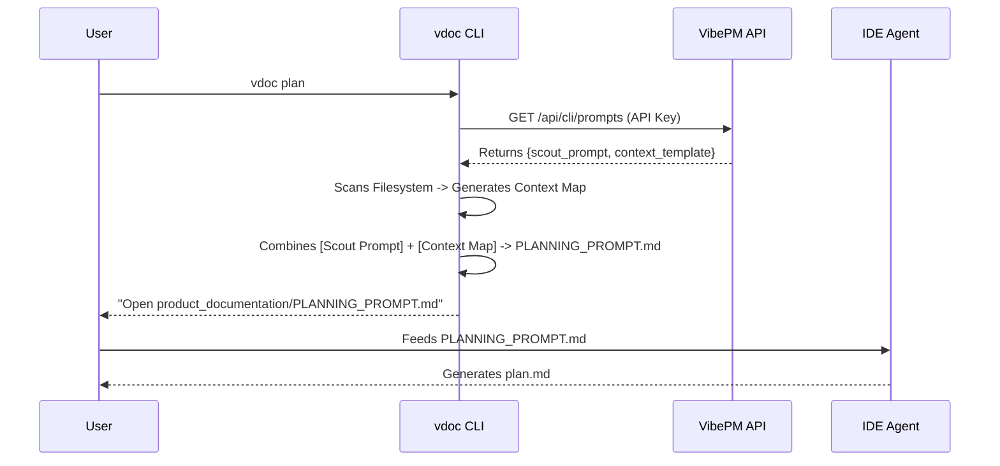

# VibePM CLI (`vdoc`) - Product Requirements & Technical Spec
**Version:** 1.0.0
**Target Repository:** [sandrinio/vdoc_documentator](https://github.com/sandrinio/vdoc_documentator)
**Backend API:** VibePM Intelligence Service (Production)
---
## 1. Product Vision
The **vdoc CLI** is a "Context Builder" for AI Agents.
It does **not** run LLMs itself. Instead, it automates the tedious work of finding files, reading git diffs, and formatting them into perfect "Prompts" that a user can paste into their IDE's AI (Cursor, Antigravity, Copilot).
**The Core Loop:**
1.  **CLI** gathers context & fetches instructions from the Cloud.
2.  **CLI** generates a `PROMPT.md` file.
3.  **User** feeds `PROMPT.md` to their IDE Agent.
4.  **IDE Agent** writes the actual documentation.
---
## 2. Architecture: "The Prompt Driver"
The CLI acts as a **Stateful Orchestrator**. It maintains knowledge of the local project structure but offloads "intelligence" definitions to the VibePM Backend.
### The "Thin Client" Logic
*   **Brain (Prompts):** Live in VibePM Backend. The CLI must fetch them at runtime.
*   **Memory (State):** Lives in `.vdoc/state.json` (Local).
*   **Eyes (Scanner):** The CLI scans the local filesystem.
*   **Hands (Writer):** The IDE Agent (not the CLI).
### Data Flow Diagram

---
## 3. Functional Requirements
### A. Authentication & Config
*   **Goal:** Connect the local CLI to the specific VibePM Project.
*   **Mechanism:**
    *   User runs `vdoc init --api-key <KEY>`.
    *   CLI verifies key against `GET /api/cli/config`.
    *   CLI saves config to `.vdoc/config.json`.
*   **Requirement:** Fail gracefully if offline or invalid key.
### B. Prompt Synchronization (Crucial)
*   **Goal:** Ensure the CLI always uses the latest "System Prompts" defined by the VibePM team, without needing to upgrade the CLI binary.
*   **Mechanism:**
    *   **Endpoint:** `GET /api/cli/prompts`
    *   **Header:** `x-api-key: <PROJECT_API_KEY>`
    *   **Response:** JSON containing `scout_system_prompt`, `writer_system_prompt`, etc.
*   **Constraint:** Cache these prompts briefly (e.g., for the session), but prefer fresh fetch.
### C. The "Slash Command" Protocol
*   **Concept:** Since we cannot rely on every IDE (Cursor, VS Code, Terminal) having native UI buttons, we define a **Text-Based Protocol** in the System Prompt.
*   **Mechanism:**
    *   The `scout_system_prompt` explicitly tells the AI: "If user says `/plan`, execute the planning logic."
    *   This works in **any** interface (Web, Terminal, IDE) because it is parsed by the LLM, not the GUI.
*   **Requirement:** The CLI must transparently pass these prompts so the user's Agent "learns" these commands immediately.
### D. Usability (Shell Completion)
*   **Goal:** User should be able to type `vdoc [TAB]` and see available commands (`init`, `plan`, `update`).
*   **Mechanism:** Leverage `Typer`'s built-in shell completion support (`--install-completion`).
*   **Requirement:** The installation instructions must include how to enable this.
---
## 4. Command Specification
### 1. `vdoc init`
**Role:** The Bootstrapper.
**Actions:**
1.  **Config:** Check/Create `.vdoc/config.json`.
2.  **Context:** Fetch template & scan repo -> `.vdoc/CONTEXT_MAP.md`.
3.  **IDE Integration (Auto-Detect):**
    *   **IF Antigravity (~/.agent):** Create `.agent/workflows/vdoc-plan.md` (Populates Dropdown).
    *   **IF Cursor (.cursorrules):** Create/Append to `.cursorrules`:
        > "Documentation Rules: If user says /plan, read product_documentation/PLANNING_PROMPT.md..."
    *   **IF VS Code:** Suggest installing `vdoc` as a Task in `.vscode/tasks.json`.
**Output Message:** "Project initialized. IDE integrations configured."
### 2. `vdoc plan`
**Role:** The Architect.
**Logic:**
1.  **Auto-Init Check:** If `.vdoc/CONTEXT_MAP.md` is missing, implicitly run `vdoc init`.
2.  **Resumability Check:**
    *   Check if `.vdoc/doc_plan.md` already exists.
    *   If it exists and has "status: ready", ask user: "Plan exists. Do you want to re-generate it or proceed to exec?"
3.  **Action (if generating):**
    *   Fetch `scout_system_prompt`.
    *   Read `.vdoc/CONTEXT_MAP.md`.
    *   Generate `product_documentation/PLANNING_PROMPT.md`.
**Output Message:** "Planning prompt generated. Open `PLANNING_PROMPT.md` and feed it to your IDE Agent to create the `.vdoc/doc_plan.md`."
### 3. `vdoc exec`
**Role:** The Builder.
**Logic:**
1.  **Prerequisite Check:** Ensure `.vdoc/doc_plan.md` exists.
2.  **Validation:** Parse `.vdoc/doc_plan.md` to ensure it has valid checkboxes or task list.
3.  **Action:**
    *   Fetch `writer_system_prompt`.
    *   Read the Plan.
    *   Gather content of files mentioned in the plan.
    *   Generate `product_documentation/EXECUTION_PROMPT.md`.
**Output Message:** "Execution prompt generated with full context. Feed `EXECUTION_PROMPT.md` to your IDE Agent to write the documentation."
---
## 5. User Interaction Guide (CLI vs Chat)
It is critical to distinguish between the **Terminal** (where you run the tool) and the **IDE Chat** (where you talk to the compiled context).
### A. Terminal (The Engine)
*   **Where**: bash/zsh/powershell
*   **Syntax**: `vdoc [command]` (No slash)
*   **Example**: `vdoc plan`, `vdoc exec`
### B. IDE Chat (The Brain)
*   **Where**: Cursor Chat, Copilot, Antigravity
*   **Syntax**: `/vdoc [command]` (Detailed namespace)
*   **Limitations**: You will **not** see a UI dropdown menu (that requires a plugin).
*   **Example**:
    *   `/vdoc help`: "List all available vdoc commands."
    *   `/vdoc plan`: "Hey Agent, re-read the context and make a plan."
*   **Note for Terminal LLMs (Claude Code, Gemini CLI)**:
    Since these tools run *inside* your terminal shell:
    1.  **Use the Native Command**: Prefer running `vdoc plan` directly as a shell command. It is faster and native.
    2.  **Use Slash Command**: ONLY use `/vdoc plan` if you are inside a specific "Chat Mode" that doesn't accept shell commands.
    *   *Rule of Thumb*: If you can type `ls`, type `vdoc`. If you can only type chat, type `/vdoc`.
---
## 6. Technical Constraints
*   **Language:** Python 3.10+ (Recommended for strong string handling).
*   **CLI Framework:** `Typer` (Standard, robust).
*   **HTTP Client:** `httpx` (Async support).
*   **Distribution:** Must be packageable via `pip` or `brew`.
*   **Security:** Never send source code TO the backend. Only pull prompts FROM the backend. Local source code stays local.
---
## 7. Future Roadmap
### `vdoc serve` (The MCP Mode)
*   **Role:** The Native Integrator (Post-MVP).
*   **Concept:** Turn the CLI into a [Model Context Protocol (MCP)](https://modelcontextprotocol.io) server.
*   **Requirements:**
    *   Expose `vdoc-plan` and `vdoc-exec` as **MCP Prompts**.
    *   This will allow users to click these commands in the slash menu of supported clients (Claude Desktop, etc.).
